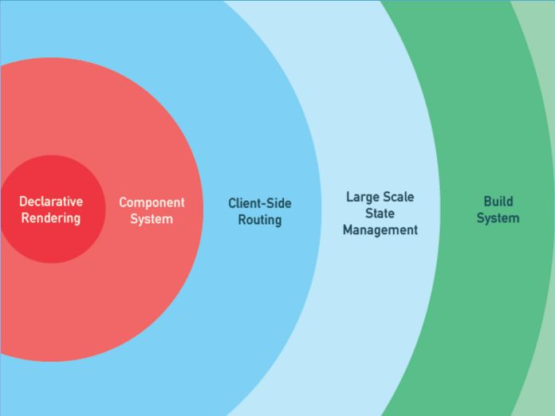

# {{ $page.title }}

> [The best front-end framework to learn in 2019](https://dev.to/duomly/the-best-front-end-framework-to-learn-in-2019-dn7)

> [Vue.js](https://cn.vuejs.org/v2/guide/#)

> [Vue对比其他框架](https://cn.vuejs.org/v2/guide/comparison.html)

2019年最值得学习的前端框架:

- React

- Angular

- AngularJS

- Vue.js

- jQuery

- Ember.js

- Backbone.js

**不推荐新手直接使用`vue-cli`，尤其是在你还不熟悉基于`Node.js`的构建工具时。**

## 渐进式框架

> [Vue2.0 中，“渐进式框架”和“自底向上增量开发的设计”这两个概念是什么？](https://www.zhihu.com/question/51907207)

> [Vue.js，何謂漸進式框架？](https://medium.com/@gotraveltoworld/vue-js-何謂漸進式框架-7d0281a7efa9)

The Progressive JavaScript Framework, 自底向上逐层应用。

## 响应式前端框架

> [响应式前端框架](https://juejin.im/post/5cc56fc06fb9a031fc63b8d2)

> [vue总结系列--数据驱动和响应式](https://segmentfault.com/a/1190000015452018)

## 虚拟DOM

> [如何理解虚拟DOM?](https://juejin.im/entry/5aedcfa351882506a36c664c)

> [详解Vue中的虚拟DOM](https://blog.fundebug.com/2019/06/26/vue-virtual-dom/)

> [虚拟DOM介绍](https://www.jianshu.com/p/616999666920)

> [全面理解虚拟DOM，实现虚拟DOM](https://foio.github.io/virtual-dom/)

一种可以预先通过`js`进行各种计算, 把最终的`DOM`操作计算出来的并优化的技术,
由于这个`DOM`操作属于预处理操作, 并没有真实的操作`DOM`, 所以叫做虚拟`DOM`。

Vue.js 2.0引入 **Virtual DOM**,比Vue.js 1.0的初始渲染速度提升了2-4倍，并大大降低了内存消耗。

## 双向数据绑定

> [vue 双向数据绑定实现原理](https://juejin.im/entry/59116fa6a0bb9f0058aaaa4c)

> [从单向到双向数据绑定](https://juejin.im/post/5ad1dfdc6fb9a028ba1fe9b2)

> [Vue 双向数据绑定原理分析](https://www.jianshu.com/p/d3a15a1f94a0)

## PWA

> [什么是 PWA](https://lavas.baidu.com/pwa)

> [简单介绍一下Progressive Web App(PWA)](https://juejin.im/post/5a6c86e451882573505174e7)

**Progressive Web App, 渐进式网页应用**。
